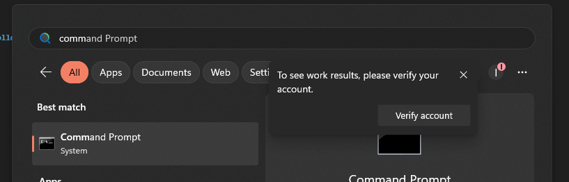
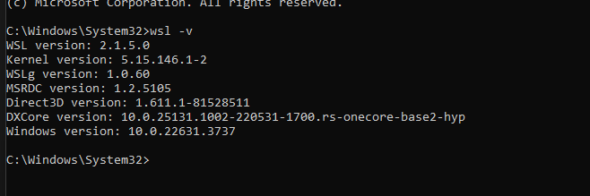
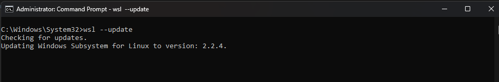
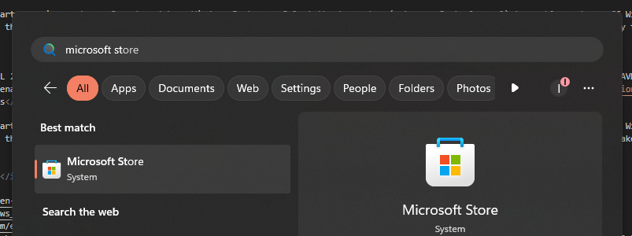
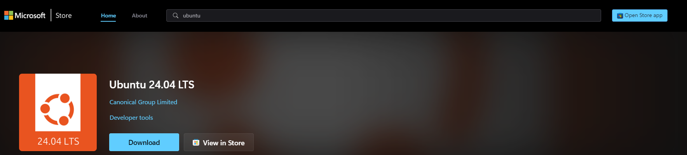
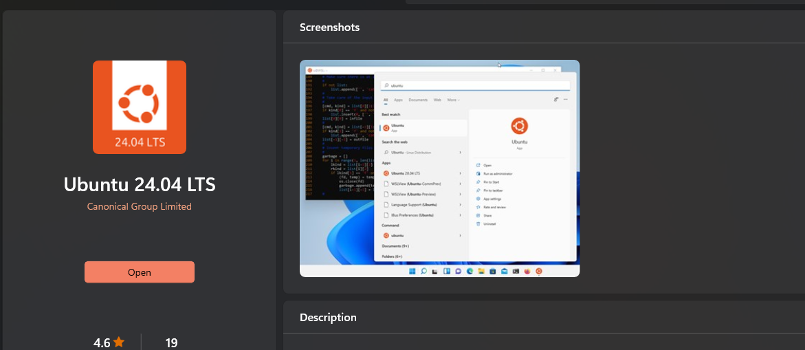
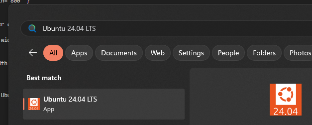
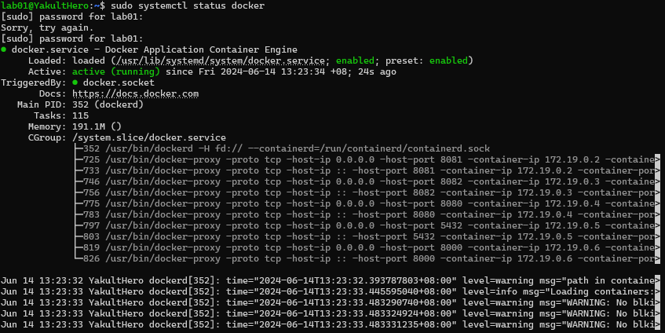

# Deployment

## Deployment of Kyzen POS 

### Deploy to Windows with WSL2

#### Pre-deployment
<mark>Important note:</mark> you must be running the latest version of Windows 10 v22H2 or Windows 11 v23H2.

<h6>Verify if the WSL/WSL2 is installed and latest version</h6>
Open the Start Menu and search for Command Prompt (or PowerShell), right-click the top result, and select the Run as administrator option
<figure markdown>
  { width="800" }
</figure>

Type the following command to check the version of WSL installed on the device and press Enter: `wsl -v`
<figure markdown>
  { width="800" }
</figure>

If the version if not 2, run the following command to update the version: `wsl --update`
<figure markdown>
  { width="800" }
</figure>

If the wsl is not installed on the windows, follow the steps below to install the WSL
<h6>Windows 10</h6>
- Right-click on the Windows Start menu icon, choose Search and type Windows Features. Select the top entry (category Control panel) to enable or turn off Windows-Features. The Windows-Features dialog will be opened.
- Select in the upcoming dialog the check box for Windows Subsystem for Linux from the bottom of the list and press the OK button. Applying the changes may take a few minutes. Finally, press the Restart now button to reboot the computer.

<h6>Windows 11</h6>
<mark>Important note:</mark> WSL 2 requires virtualization technology on the computer. For AMD CPUs this technology is called AMD Secure Virtual Machine (AVM-SVM) or AMD Virtualization (AMD-V), for Intel CPUs it is called Intel VTX. Instructions how to enable virtualization technology can be found here: <a href="https://support.microsoft.com/en-us/windows/enable-virtualization-on-windows-11-pcs-c5578302-6e43-4b4b-a449-8ced115f58e1">Enable virtualization on Windows 11 PCs</a>.

- Right-click on the Windows Start menu icon, choose Search and type Windows Features. Select the top entry (category Control panel) to enable or turn off Windows-Features. The Windows-Features dialog will be opened.
- Select in the upcoming dialog the check box for Virtual Machine Platform from the bottom of the list and press the OK button. Applying the changes may take a few minutes. Finally, press the Restart now button to reboot the computer.

<i>more info can be found here:</i>

- <https://learn.microsoft.com/en-us/windows/wsl/install>
- <https://www.ridom.de/u/Windows_Subsystem_For_Linux.html>
- <https://support.microsoft.com/en-us/windows/enable-virtualization-on-windows-11-pcs-c5578302-6e43-4b4b-a449-8ced115f58e1>
- <https://pureinfotech.com/check-wsl-version-windows-10/#:~:text=Open%20Start.,the%20Run%20as%20administrator%20option.&text=Quick%20tip%3A%20You%20can%20also,on%20Windows%2011%20or%2010>
- <https://learn.microsoft.com/en-us/windows/wsl/install-manual>

##### Install Ubuntu
Open Microsoft Store
<figure markdown>
  { width="800" }
</figure>

Search for Ubuntu 24.04 or later and click get or download to install
<figure markdown>
  { width="800" }
</figure>
<figure markdown>
  { width="800" }
</figure>

#### Deployment proper
Open start menu and seacrh for Ubuntu to start the server.
<figure markdown>
  { width="800" }
</figure>

First run it will ask to create a user and password.

After setting this up, you may proceed with the instruction below.

##### Install Docker
<b>Add Docker's official GPG Key</b>

- sudo apt-get update
- sudo apt-get install ca-certificates curl
- sudo install -m 0755 -d /etc/apt/keyrings
- sudo curl -fsSL https://download.docker.com/linux/ubuntu/gpg -o /etc/apt/keyrings/docker.asc
- sudo chmod a+r /etc/apt/keyrings/docker.asc

<b>Add repository to apt source and install docker</b>

- copy the code below and paste it to terminal then press enter.
```
echo \
  "deb [arch=$(dpkg --print-architecture) signed-by=/etc/apt/keyrings/docker.asc] https://download.docker.com/linux/ubuntu \
  $(. /etc/os-release && echo "$VERSION_CODENAME") stable" | \
  sudo tee /etc/apt/sources.list.d/docker.list > /dev/null
```
- run update: 
```
sudo apt-get update -y
```
- proceed with the installation of docker: 
```
sudo apt-get install docker-ce docker-ce-cli containerd.io docker-buildx-plugin docker-compose-plugin -y
```
next is add the current user to docker inorder to run it without sudo
```
sudo usermod -aG docker $USER
```
verify if the docker is installed properly, run the following command:
```
sudo systemctl status docker
```
<figure markdown>
  { width="800" }
</figure>

<b>Login to the docker private registry</b>

- Check your password manager for the credentials
- Login to the docker hub
```
docker login <user_name>
```
- it will ask for the password.

<b>Create a new folder for data persistence</b>

- Create `pos` folder on the home directory that will store the yaml and pos-db data
- To create the folder, follow the command below:
    - ```cd ``` > to go to the root(home) directory
    - ```pwd ``` > to get the current working directory which is `/home/<user>`
        - make sure if you will create the direcetory you must be on `/home/pos` or `/home/<user>` where as the `user` is the one that has been created during the installation process
    - ```mkdir -p pos/docker-datas/pos-db``` > this will create the directory
        - `pos` > main dir
        - `docker-datas/pos-db` > db data

<b>Create .env file</b>

- To create the .env file, follow the command below:
- Make sure you are in the home directory, if not run this command:
    - ```cd ``` > to go to the root(home) directory
    - ```pwd ``` > to get the current working directory which is `/home/<user>`
- Then go to the created directory and create the .env file:
    - ```cd pos``` > which is the created directory a while ago
    - ```nano .env``` > this will create the .env file
    - paste the value below:

```
  EMAIL_USE_TLS=True
  EMAIL_HOST=<check_password_manager>
  EMAIL_HOST_USER=<check_password_manager>
  EMAIL_HOST_PASSWORD=<check_password_manager>
  EMAIL_PORT=587
  DJANGO_SECRET_KEY=<check_password_manager>
  DJANGO_DATABASE_HOST=pos-db
  DJANGO_DATABASE_PORT=5432
  DJANGO_DATABASE_NAME=<check_password_manager>
  DJANGO_DATABASE_USER=<check_password_manager>
  DJANGO_DATABASE_PASSWORD=<check_password_manager>
  PORT=80
  GENERATE_SOURCEMAP=false
  REACT_APP_API_BASE_URL=http://pos-api.raspberry.pi:8000/api
```
- Then save it using the following command:`CTRL + X, type Y and enter.`

<b>Clone the repository for the deployment</b>

- there are two ways to clone the repository via https and via ssh
    - via http
        - 

            ```
            git clone https://github.com/drc29/pos-deploy
            ```

        - this will ask a username and password, check your password manager for the credentials

    - via ssh
        - 
            ```
                git clone git@github.com:drc29/pos-deploy.git
            ```
- After cloning the repository, copy the docker-compose-linux.yaml file to the `/home/<user>/pos` using the following command:
    - `cd pos-deploy` > go to the pos-deploy folder
    - `cp docker-compose-linux.yaml /home/<user>/pos`

<b>Start the service</b>

- To start the service go to the `pos` directory: `cd /home/<user>/pos`
- Run it via docker compose: `docker compose -f docker-compose-linux.yaml up -d` > this will automatically pull the images on the private and public docker registry.
- To verify if the services are running properly, you can run the following command: `docker ps` > this will list all running docker containers

<b>Migrate and Creater admin user</b>

- Go inside the docker container which is `pos-api` using the following command: `docker exec -ti pos-api bash`
- Then run the following command to migrate: `python manage.py migrate`
- After running the migrate, run this to create superuser or admin: `python manage.py createsuperuser`
    - Just follow the instruction to create the supper user

<b>Update hosts of the windows desktop</b>

- Also, update the hosts file of the desktop(windows machine), how to update the hosts please see this guide: <https://docs.rackspace.com/docs/modify-your-hosts-file> or 
- Open this on Notepad with Administrator privileges: `c:\Windows\System32\Drivers\etc\hosts`
- Make the necessary changes to the file, add the following: 
```
127.0.0.1 pos-cashier.raspberry.pi pos-management.raspberry.pi pos-api.raspberry.pi
```
- Select File > Save to save your changes.


<b>After you have finished all the steps, you can now access the pos-api, pos-cashier and pos-management</b>

#### Attach the printer from host to wsl

- Open windows terminal
- install usbipd-win using the following command: winget install usbipd
- list the available device: usbipd list
```
check for the Device: e.g: USB Printer name
check for it's BUSID: e.g: x-x -> 2-1
```
- Then bind it using the following command:
```
usbipd bind --busid <busid> -> usbipd bind --busid 1-2

usbipd attach --wsl --busid <busid> -> usbipd attach --wsl --busid 1-2
```
- then verify again the the device is shared using the following command: usbipd list , on the state it must be Attached or Shared.

ref:

<https://github.com/dorssel/usbipd-win?tab=readme-ov-file#usbipd-win>
<https://learn.microsoft.com/en-us/windows/wsl/connect-usb>

<b>After attaching the printer</b>

- Restart the pos-api on wsl by going to the ubuntu server by searching it on the start and restarting the docker container using the following command: `docker restart pos-api`
- Then test it by going to the `pos-api` container: `docker exec -ti pos-api bash`
- Run the following command to test: `python printer.py`


#### Additional to start the service upon startup

- Copy the contents of the `script` folder on the startup folder using the steps below
- open run(windows key + r)
- paste the command: `shell:startup` to open the startup directory
- copy the `wsl-start.vbs` from the script folder to the startup directory

<mark>Important:</mark>  make sure to update the `wsl-start.vbs` and change the busid and distro.

### Deploy to RPI

### Deploy to Ubuntu

## Deployment of machine controller